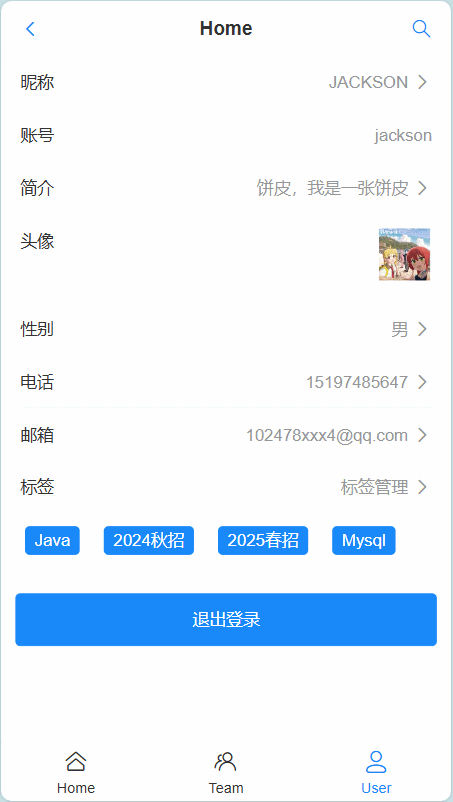
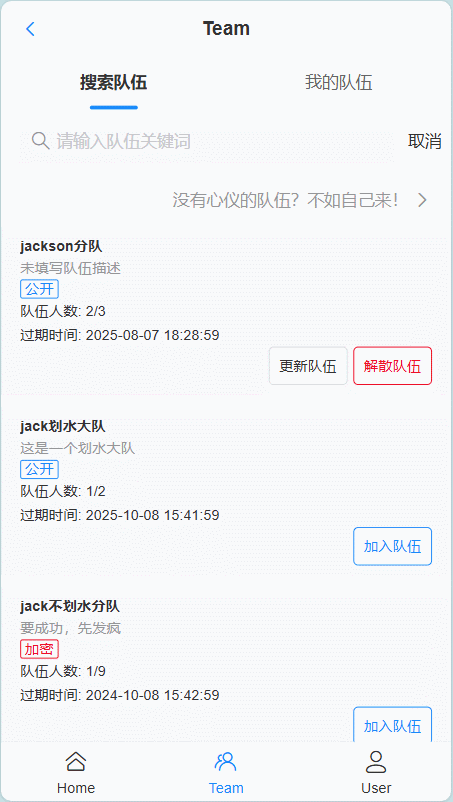
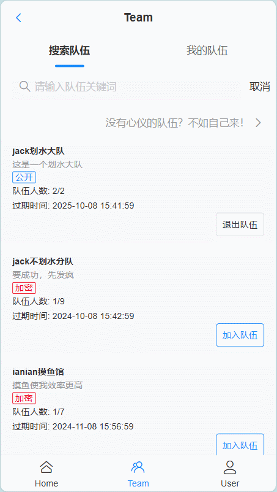

# 1 项目介绍

- 后端代码仓库：
    - [HongruiJackson/partner-search-backend (github.com)](https://github.com/HongruiJackson/partner-search-backend)
    - [Hongrui_Jackson/partner-search-backend (gitee.com)](https://gitee.com/JacksonZHR/partner-search-backend)
- 前端代码仓库：
    - [HongruiJackson/partner-search-frontend (github.com)](https://github.com/HongruiJackson/partner-search-frontend)
    - [Hongrui_Jackson/partner-search-frontend (gitee.com)](https://gitee.com/JacksonZHR/partner-search-frontend)

## 1.1 项目概述
该系统皆在建立一个平台，让用户能够找到志同道合的伙伴，通过用户自行的标签标记，能够让用户找到相似标签的伙伴；同时，系统也支持队伍招揽，以支持多人的团体活动

## 1.2 部分功能一览
用户注册/登录/登出功能


用户信息编辑


用户个人标签管理，可以搜索标签



根据标签搜索用户


加入/退出/解散队伍



创建队伍



搜索队伍


## 1.2 部分需求列述
1. 用户注册、登录、注销
2. 用户标签管理
3. 主动搜索标签：允许用户根据标签去搜索其他用户
4. 组队：允许用户创建队伍、查询队伍、加入队伍

## 1.3 技术栈
### 1.3.1 前端
1. vue3开发框架
2. vant UI
3. Vite打包工具
4. nginx单机部署
5. pinia状态管理

### 1.3.2 后端
1. Java编程+SpringBoot框架
2. SpringMVC+MyBatis+MyBatisPlus
3. MySQL数据库
4. Redis缓存
5. apifox插件文档


# 2 项目初始化及环境
## 2.1 前端
```json
{
	"dependencies": {  
	  "pinia": "^2.1.7",  
	  "vant": "^4.9.5",  
	  "vue": "^3.4.29",  
	  "vue-router": "^4.3.3"  
	}
}
```
### 2.1.1 Vue框架
[快速上手 | Vue.js (vuejs.org)](https://cn.vuejs.org/guide/quick-start.html)
1. 框架引入
```shell
npm create vue@latest
```
2. 可选配置参考，以下三项选择是，其余否
```shell
√ 请输入项目名称： ... parterner-search-frontend
√ 是否使用 TypeScript 语法？ ... 否 / 是
√ 是否引入 Vue Router 进行单页面应用开发？ ... 否 / 是
√ 是否引入 Pinia 用于状态管理？ ... 否 / 是
√ 是否引入 ESLint 用于代码质量检测？ ... 否 / 是
```
3. npm换源 [npmmirror 镜像站](https://npmmirror.com/)
```shell
npm config set registry https://registry.npmmirror.com
```
4. 依赖导入和验证启动
```shell
npm install
npm run dev
```

### 2.1.2 Vant 4组件库
 [快速上手 - Vant 4 (vant-ui.github.io)](https://vant-ui.github.io/vant/#/zh-CN/quickstart)
1. 安装vant
```shell
npm i vant
```
1. 使用按需引入插件减小代码体积
```shell
npm i @vant/auto-import-resolver unplugin-vue-components unplugin-auto-import -D
```
2. 配置插件
```js
import vue from '@vitejs/plugin-vue';
import AutoImport from 'unplugin-auto-import/vite';
import Components from 'unplugin-vue-components/vite';
import { VantResolver } from '@vant/auto-import-resolver';

export default {
  plugins: [
    vue(),
    AutoImport({
      resolvers: [VantResolver()],
    }),
    Components({
      resolvers: [VantResolver()],
    }),
  ],
};

```
3. 轻提示的样式不显示
```js
import 'vant/es/toast/style'  
import 'vant/es/notify/style'
```
## 2.2 后端
- Springboot：2.7.6
- Maven：3.8.6
- jdk：17
- Mysql：8.0.27

## 2.3 数据库相关
### 2.3.1 Redis安装
- Linux环境：`ubuntu`
1. apt-get安装
```shell
sudo apt-get install lsb-release curl gpg
curl -fsSL https://packages.redis.io/gpg | sudo gpg --dearmor -o /usr/share/keyrings/redis-archive-keyring.gpg
sudo chmod 644 /usr/share/keyrings/redis-archive-keyring.gpg
echo "deb [signed-by=/usr/share/keyrings/redis-archive-keyring.gpg] https://packages.redis.io/deb $(lsb_release -cs) main" | sudo tee /etc/apt/sources.list.d/redis.list
sudo apt-get update
sudo apt-get install redis
```
2. 启动并查看启动状态
```shell
sudo systemctl enable redis-server
sudo systemctl status redis
```
3. 默认文件、目录位置
使用`systemctl enable redis-server`，会自动在etc目录下去链接安装时生成的文件
生成的时候就有了`.service`文件了
默认conf目录：`/etc/redis`
文件默认目录：`/var/lib/redis`
启动目录：`/usr/bin/redis-server`
默认系统配置文件：`/lib/systemd/system/redis-server.service`
日志：`/var/log/redis/redis-server.log`
4. 修改配置文件
```shell
vim /etc/redis/redis.conf
```

```vim
#监听地址,0.0.0.0可以在任意IP访问
bind 0.0.0.0

#密码
requirepass 123456
```
5. 重启服务
```shell
systemctl restart redis
systemctl status redis
```
# 3 核心功能需求分析
## 3.1 用户相关
### 3.1.1 用户注册
- **非空校验**：确保账号、密码和校验密码这三个参数都不是空白的。
- **账号长度要求**：用户账号的长度至少为4个字符。
- **密码长度要求**：用户设置的密码以及确认密码的长度都至少需要8个字符。
- **密码一致性校验**：用户输入的密码必须与校验密码相匹配。
- **特殊字符限制**：用户账号中不能包含特定的特殊字符（如`_`, `!`, `@`, 等等）。
- **唯一性校验**：用户账号在整个系统内是唯一的，不允许重复注册相同的账号。
- **密码加密**：使用SHA-256算法对用户密码进行加密处理，并在加密前添加一个固定盐值`SALT`来增加安全性。
### 3.1.2 用户登录
- **非空校验**：确保账号和密码两个参数都不是空白的。
- **账号长度要求**：用户账号的长度至少为4个字符。
- **密码长度要求**：用户登录时提供的密码长度至少需要8个字符。
- **特殊字符限制**：与注册时一致，用户账号中不能包含特定的特殊字符。
- **密码加密**：使用SHA-256算法对用户提供的明文密码进行加密，并在加密前添加一个固定盐值`SALT`来增强安全性。这个加密后的密码将用于数据库中的匹配操作。
- **用户存在性检查**：通过账户名和加密后的密码作为条件，在数据库中查找是否存在相应的用户记录。如果查找不到对应记录，则说明用户名不存在或密码错误。
- **用户脱敏**：调用`getSafetyUser(user)`方法对返回给客户端的用户对象进行脱敏处理，这可能涉及到隐藏某些敏感信息以增加安全性。
- **设置登录状态**：将经过脱敏处理后的用户对象存储到当前HTTP请求的Session中，键名为`USER_LOGIN_STATE`。这样可以保持用户的登录状态，直到Session过期或被手动注销。

### 3.1.3 用户登出
- **清除登录状态**：从当前用户的HTTP会话中移除属性`USER_LOGIN_STATE`，这个属性通常用来标识用户是否已经登录以及保存了哪些用户信息。移除该属性意味着用户将不再处于登录状态。

### 3.1.4 根据标签列表搜索用户
- **非空校验**：确保传入的`tags`列表不为空或仅包含空元素。如果`tags`列表为空，则抛出一个`BusinessException`异常，错误码为`PARAMS_ERROR`。
- **JSON转换**：将传入的`tags`列表转换成JSON字符串格式。这通常是为了在SQL查询中作为参数传递，或者是存储在数据库中的某种形式。
- **按标签查找用户**：使用`userMapper.selectAllByAllTags(jsonTags)`方法来查询与给定的所有标签都匹配的用户列表。这里的`selectAllByAllTags`方法假设是自定义的MyBatis映射器方法，它接受一个JSON字符串作为参数，并返回符合条件的用户列表。

### 3.1.5 更新用户
- **验证登录用户**：获取当前登录用户的ID（从`loginUser`对象中），并使用该ID从数据库中查询用户信息。
- **检查用户存在性**：如果根据ID查找不到用户，则抛出一个`BusinessException`异常，错误码为`NULL_ERROR`，表示用户不存在。
- **设置用户ID**：将传入的`user`对象的ID设置为登录用户的ID，确保更新操作只针对当前登录用户。
- **执行更新**：调用`userMapper.updateById(user)`方法，通过用户ID来更新用户信息。这里的`updateById`方法假设是MyBatis映射器中的一个自定义方法，用于根据ID更新用户数据。

## 3.2 队伍相关
### 3.2.1 创建队伍
- **请求参数非空**：确保传入的`teamAddRequest`对象不为空。
- **队伍人数限制**：队伍的最大人数必须在2到20之间（包括2和20）。
- **队伍标题长度**：队伍名称不能为空，且长度应在1到20个字符之间。
- **描述长度**：如果提供了队伍描述，其长度不能超过512个字符。
- **状态校验**：队伍的状态必须是有效的，如果未提供，默认为公开（值为0）。如果是加密状态（例如值为1），则必须提供一个不超过32个字符的密码。
- **超时时间校验**：队伍的过期时间必须大于当前时间。
- **用户创建/加入队伍数量限制**：每个用户最多只能创建或加入5个队伍。
- **设置创建者ID**：将当前登录用户的ID设置为队伍的创建者ID。
- **插入队伍信息**：将队伍信息保存到数据库中。
- **插入用户与队伍的关系**：在用户与队伍关系表中记录用户加入队伍的信息

### 3.2.3 查找队伍
- **基本查询条件处理**: 支持通过团队ID、ID列表、名称、描述、最大人数、创建人ID及状态进行组合查询。
- **权限控制**:
    - 如果非管理员尝试查询私有团队(`TeamStatusEnum.PRIVATE`)，抛出无权访问异常(`BusinessException` with `ErrorCode.NO_AUTH`)。
    - 管理员可以查看所有状态的团队。
- **过期时间处理**:
    - 默认情况下不显示已过期的团队（即`expire_time`小于当前时间或为null的团队）
    - 如果是查询自己创建/加入的团队则不受此限制。
- **结果集转换与扩展**:
    - 将原始查询得到的`Team`对象列表转换成包含额外用户信息的`TeamUserVO`对象列表。
    - 使用`BeanUtils.copyProperties`来复制属性，并且对于每个团队都关联其创建者的用户信息。
    - 对用户的敏感信息进行了脱敏处理后存储于`UserVO`对象内。
-  **分页支持**:
    - 接受并应用了来自`TeamQuery`中的分页参数（`pageNum`和`pageSize`）。
    - 分页查询的结果被正确地映射到了目标返回类型`Page<TeamUserVO>`上。
-  **异常情况处理**:
    - 当查询结果为空时，确保返回一个空记录集合而不是null。

### 3.2.3 更新队伍
-  **参数验证**: 检查 `teamId` 是否存在对应的团队记录。如果不存在，则抛出业务异常 `BusinessException`，错误码为 `PARAMS_ERROR`，并附带消息“队伍不存在”。
- **权限控制**:
    - 只有团队的创建者或者具有管理员角色 (`ADMIN_ROLE`) 的用户才能修改团队信息。
    - 如果当前登录用户既不是团队创建者也不是管理员，则抛出无权访问异常 `BusinessException`，错误码为 `NO_AUTH`。
- **团队状态更改逻辑**:
    - 当尝试将团队状态更改为加密状态 (`TeamStatusEnum.SECRET`) 时：
        - 如果团队之前的状态不是加密状态，并且没有提供新的密码，则抛出参数错误异常 `BusinessException`，错误码为 `PARAMS_ERROR`，并附带消息“未填写密码”。
    - 使用 `TeamStatusEnum.getEnumByValue` 方法来获取状态枚举值，如果找不到对应的状态枚举，则默认设置为公开状态 (`PUBLIC`)。

### 3.2.4 加入队伍
- **检查队伍是否存在**：使用 `teamId` 查询数据库，确保该队伍存在。如果不存在，则抛出业务异常 `BusinessException`，错误码为 `PARAMS_ERROR`，并附带消息“队伍不存在”。
- **用户创建或加入队伍数量限制**：检查用户是否已经创建或加入了5个队伍。如果已经达到上限，则抛出业务异常 `BusinessException`，错误码为 `FORBIDDEN`，并附带消息“最多创建和加入5个队伍”。
- **不允许加入已过期队伍**：检查队伍的过期时间 (`expireTime`)。如果队伍已经过期（即当前时间在过期时间之后），则抛出业务异常 `BusinessException`，错误码为 `FORBIDDEN`，并附带消息“队伍已过期”。
- **不允许加入私有队伍**：检查队伍的状态是否为私有 (`PRIVATE`)。如果是私有队伍，则抛出无权访问异常 `BusinessException`，错误码为 `NO_AUTH`，并附带消息“不允许加入私有队伍”。
- **加密队伍密码匹配**：如果队伍状态是加密 (`SECRET`)，则需要用户提供正确的密码。如果未提供密码或提供的密码与队伍设置的密码不匹配，则抛出参数错误异常 `BusinessException`，错误码为 `PARAMS_ERROR`，并附带消息“密码错误”。
- **防止重复加入同一队伍**：检查用户是否已经加入了该队伍。如果已经加入，则抛出业务异常 `BusinessException`，错误码为 `FORBIDDEN`，并附带消息“禁止重复加入”。
- **检查队伍人数限制**：检查当前队伍的人数是否已经达到最大限制 (`maxNum`)。如果已经达到或超过最大人数，则抛出业务异常 `BusinessException`，错误码为 `FORBIDDEN`，并附带消息“队伍已满”。

### 3.2.5 退出队伍
-  **参数校验**：
    - 方法需要一个`TeamQuitRequest`对象和一个`User`对象作为输入。
    - 如果`teamQuitRequest`为`null`，则抛出业务异常，错误码为`PARAMS_ERROR`。
- **团队存在性检查**：
    - `teamId`必须非空且大于0，否则抛出`PARAMS_ERROR`的业务异常。
    - 根据`teamId`从数据库查询对应的`Team`对象。
    - 如果找不到该团队，则抛出`NULL_ERROR`的业务异常，并提示“队伍不存在”。
- **成员资格检查**：
    - 检查当前登录用户是否属于该团队。
    - 使用`LambdaQueryWrapper`构造查询条件，确保`userId`和`teamId`匹配。
    - 如果用户不属于该团队或关系不唯一（即不是恰好一次），则抛出`PARAMS_ERROR`的业务异常，并提示“未加入队伍”。
- **解散队伍逻辑**：
    - 如果队伍只有当前退出用户一人，则解散整个队伍。
    - 删除队伍记录及所有相关联的`UserTeam`记录。
- **创建人变更**：
    - 如果退出的是团队创建者，寻找下一个最早加入的成员成为新的创建者。
    - 查询并更新`Team`表中的`userId`字段为新创建者的`userId`。
    - 如果更新失败，抛出`SYSTEM_ERROR`的业务异常，并提示“更新队伍创建人失败”。
- **移除用户与队伍的关系**：
    - 对于普通成员或成功变更创建人后的情况，删除当前用户与队伍之间的关联记录。

# 4 数据库设计
## 4.1 类别表+标签表
标签内容初步构想，以便更好地设计字段，只做两层设计
- 性别：男、女
- 方向：Java、C++、Go、前端
- 目标：考研、春招、秋招、社招、考公、竞赛
- 阶段：大一、大二、大三、大四、学生、待业、已就业、研一、研二、研三

### 4.1.1 标签表（tag）
具体的标签项

| 序号  | 变量名             | 解释        | 备注                      | sql类型    | null       |
| --- | --------------- | --------- | ----------------------- | -------- | ---------- |
| 1   | id              | 主键        | 通过数据库自增                 | bigint   | 非null      |
| 2   | tag_name        | 标签名       |                         | varchar  | 非null      |
| 3   | user_id         | 上传标签的用户id |                         | bigint   | 业务层非null校验 |
| 4   | catalog_item_id | 分类id      | 在类别表中id，确保唯一            | bigint   | 业务层非null校验 |
| 5   | create_time     | 创建时间      | 使用mysql的函数              | datetime |            |
| 6   | update_time     | 更新时间      | 使用mysql函数               | datetime |            |
| 7   | is_delete       | 是否删除      | 和业务没有关系，逻辑删除；<br>0 表示存在 | tinyint  | 默认0        |
```sql
create table tag
(
    id              bigint auto_increment comment '主键'
        primary key,
    tag_name        varchar(256)                       not null comment '标签名',
    user_id         bigint                             null comment '上传标签的用户id',
    catalog_item_id bigint                             null comment '分类id',
    create_time     datetime default CURRENT_TIMESTAMP not null comment '创建时间',
    update_time     datetime default CURRENT_TIMESTAMP not null on update CURRENT_TIMESTAMP comment '更新时间',
    is_delete       tinyint  default 0                 not null comment '逻辑是否删除'
)
    comment '标签表';


```
### 4.1.2 类别表（catalog）

| 序号  | 变量名          | 解释        | 备注                      | sql类型    | null       |
| --- | ------------ | --------- | ----------------------- | -------- | ---------- |
| 1   | id           | 主键        | 通过数据库自增                 | bigint   | 非null      |
| 2   | catalog_item | 类别名       |                         | varchar  | 非null      |
| 3   | user_id      | 上传类别的用户id |                         | bigint   | 业务层非null校验 |
| 4   | create_time  | 创建时间      | 使用mysql的函数              | datetime |            |
| 5   | update_time  | 更新时间      | 使用mysql函数               | datetime |            |
| 6   | is_delete    | 是否删除      | 和业务没有关系，逻辑删除；<br>0 表示存在 | tinyint  | 默认0        |
```sql
create table catalog  
(  
    id           bigint auto_increment comment '主键'  
        primary key,  
    catalog_item varchar(256)                       not null comment '类别名',  
    user_id      bigint                             null comment '上传标签的用户id',  
    create_time  datetime default CURRENT_TIMESTAMP not null comment '创建时间',  
    update_time  datetime default CURRENT_TIMESTAMP not null on update CURRENT_TIMESTAMP comment '更新时间',  
    is_delete    tinyint  default 0                 not null comment '逻辑是否删除'  
)  
    comment '类别表';
```


## 4.2 用户表（user）

| 序号  | 变量名           | 解释     | 备注                      | sql类型    | null  |
| --- | ------------- | ------ | ----------------------- | -------- | ----- |
| 1   | id            | 主键     | 通过数据库自增                 | bigint   | 非null |
| 2   | user_account  | 登录账号   |                         | varchar  | 非null |
| 3   | user_password | 密码     |                         | varchar  | 非null |
| 4   | tags          | 用户具有标签 |                         | json     |       |
| 5   | username      | 用户昵称   |                         | varchar  |       |
| 6   | avatar_url    | 头像     |                         | varchar  |       |
| 7   | gender        | 性别     | 0 表示男性；1 表示女性           | tinyint  |       |
| 8   | phone         | 电话     |                         | varchar  |       |
| 9   | email         | 邮箱     |                         | varchar  |       |
| 10  | user_status   | 账号状态   | 0 表示正常，默认为0             | int      | 非null |
| 11  | user_role     | 角色     | 0 默认用户 1 管理员            | int      | 非null |
| 12  | create_time   | 创建时间   | 使用mysql的函数              | datetime | 非null |
| 13  | update_time   | 更新时间   | 使用mysql函数               | datetime | 非null |
| 14  | is_delete     | 是否删除   | 和业务没有关系，逻辑删除；<br>0 表示存在 | tinyint  | 非null |

```sql
create table user
(
    id            bigint auto_increment comment '主键'
        primary key,
    user_account  varchar(256)                       null comment '登录账号',
    user_password varchar(256)                       not null comment '密码',
    tags          json                               null comment '用户具有的标签',
    profile       varchar(512)                       null comment '用户简介',
    username      varchar(256)                       null comment '用户昵称',
    avatar_url    varchar(256)                       null comment '头像',
    gender        tinyint                            null comment '性别，0 表示男性；1 表示女性',
    phone         varchar(30)                        null comment '电话',
    email         varchar(60)                        null comment '邮箱',
    user_status   int                                null comment '账号状态，0 表示正常',
    user_role     int      default 0                 not null comment '0 默认用户 1 管理员',
    create_time   datetime default CURRENT_TIMESTAMP not null comment '创建时间',
    update_time   datetime default CURRENT_TIMESTAMP not null on update CURRENT_TIMESTAMP comment '更新时间',
    is_delete     tinyint  default 0                 not null comment '逻辑是否删除'
)
    comment '用户表';


```

## 4.3 队伍及队伍用户关系
### 4.3.1 队伍表（team）

| 序号  | 变量名           | 解释    | 备注                      | sql类型    | null  |
| --- | ------------- | ----- | ----------------------- | -------- | ----- |
| 1   | id            | 主键    | 通过数据库自增                 | bigint   | 非null |
| 2   | name          | 队伍名称  |                         | varchar  | 非null |
| 3   | description   | 描述    |                         | varchar  |       |
| 4   | max_num       | 最大人数  |                         | int      | 非null |
| 5   | expire_time   | 过期时间  |                         | datetime |       |
| 6   | user_id       | 创建人id |                         | bigint   | 非null |
| 7   | team_status   | 状态    | 0公开；1私密；2加密，默认0         | int      | 非null |
| 8   | team_password | 密码    |                         | varchar  |       |
| 9   | create_time   | 创建时间  | 使用mysql的函数              | datetime | 非null |
| 10  | update_time   | 更新时间  | 使用mysql函数               | datetime | 非null |
| 11  | is_delete     | 是否删除  | 和业务没有关系，逻辑删除；<br>0 表示存在 | tinyint  | 非null |

```sql
create table team
(
    id            bigint auto_increment comment '主键'
        primary key,
    name          varchar(256)                       not null comment '队伍名称',
    description   varchar(256)                       null comment '描述',
    max_num       int                                not null comment '最大人数',
    expire_time   datetime                           null comment '过期时间',
    user_id       bigint                             not null comment '创建人id',
    team_status   int      default 0                 not null comment '队伍状态：0公开；1私密；2加密，默认0',
    team_password varchar(256)                       null comment '队伍密码',
    create_time   datetime default CURRENT_TIMESTAMP not null comment '创建时间',
    update_time   datetime default CURRENT_TIMESTAMP not null on update CURRENT_TIMESTAMP comment '更新时间',
    is_delete     tinyint  default 0                 not null comment '是否删除，逻辑删除； 0 表示存在'
)
    comment '队伍表';


```


### 4.3.2 队伍用户关系表（user_team）

| 序号  | 变量名         | 解释   | 备注                      | sql类型    | null  |
| --- | ----------- | ---- | ----------------------- | -------- | ----- |
| 1   | id          | 主键   | 通过数据库自增                 | bigint   | 非null |
| 2   | user_id     | 用户id |                         | bigint   | 非null |
| 3   | team_id     | 队伍id |                         | bigint   | 非null |
| 4   | join_time   | 加入时间 |                         | datetime |       |
| 5   | create_time | 创建时间 | 使用mysql的函数              | datetime | 非null |
| 6   | update_time | 更新时间 | 使用mysql函数               | datetime | 非null |
| 7   | is_delete   | 是否删除 | 和业务没有关系，逻辑删除；<br>0 表示存在 | tinyint  | 非null |

```sql
create table user_team
(
    id          bigint auto_increment comment '主键'
        primary key,
    user_id     bigint                             not null comment '用户id',
    team_id     bigint                             not null comment '队伍id',
    join_time   datetime                           null comment '加入时间',
    create_time datetime default CURRENT_TIMESTAMP not null comment '创建时间',
    update_time datetime default CURRENT_TIMESTAMP not null on update CURRENT_TIMESTAMP comment '更新时间',
    is_delete   tinyint  default 0                 not null comment '逻辑删除； 0 表示存在'
);

```
# 5 部分功能细节文档
## 5.1 标签检索用户
### 5.1.1 字段类型处理
在设计库的时候，我选择了直接将`tags`字段设计为了`json`类型，存储`["Java", "Python"]`这样的内容，以便之后可以调用MySQL所提供的函数进行根据用户的筛选，但使用mybatisX生成的Java类类型为`Object tags`，这就会导致前端拿到的数据为
```json
{
	"tags": "[\"Java\", \"Python\"]",
}
```
即想要的是一个数组，但就成了一堆的字符串，这就需要对字段进行处理，而MP内置了对JSON的字段处理器[字段类型处理器 | MyBatis-Plus (baomidou.com)](https://baomidou.com/guides/type-handler/#json-%E5%AD%97%E6%AE%B5%E7%B1%BB%E5%9E%8B%E5%A4%84%E7%90%86%E5%99%A8)
1. 引入gson依赖，可以选择其他的序列化工具
```xml
<dependency>  
    <groupId>com.google.code.gson</groupId>  
    <artifactId>gson</artifactId>  
</dependency>
```
2. 对实体类的操作`autoResultMap = true`和 `@TableField(typeHandler = GsonTypeHandler.class)`
```java
@TableName(value ="user",autoResultMap = true)  
@Data  
public class User implements Serializable {
	@TableField(typeHandler = GsonTypeHandler.class)
	private List<String> tags;
}
```
3. 对应的映射文件`UserMapper.xml`
```xml
	<result property="tags" column="tags" jdbcType="OTHER" typeHandler="com.baomidou.mybatisplus.extension.handlers.GsonTypeHandler"/>
```
4. 最后结果
```json
{
    "data": {
        "id": 1,
        "userAccount": "jackson",
        "userPassword": null,
        "tags": [
            "Java",
            "Python"
        ],
    },
    "message": "ok",
}
```

### 5.1.2 字段查询Json知识
由于我想要从json数组当中查取数据，且所有的tags都是设计好的，不会出现模糊查询的情况，故采用Mysql自带的函数是一个不错的选择，这里给出mysql的参考文档的json函数部分[MySQL :: MySQL 8.4 Reference Manual :: 14.17.1 JSON Function Reference](https://dev.mysql.com/doc/refman/8.4/en/json-function-reference.html)

在数据库存储的数据格式为如下：
```sql
["Java", "Python", "JS"]
```
使用MySQL数据库提供的函数可以如下进行查询：
```sql
select * from user where JSON_CONTAINS(tags, '"Java"')
```
也可以进行如下的查询，判断是否为数据库内容的子集，涉及到业务就是标签且的关系
```sql
select * from user where JSON_CONTAINS(tags, '["Java","Python"]')
```

### 5.1.3 mapper层核心代码
#### 5.1.3.1 多个标签或关系搜索用户
在映射配置文件和mapper接口当中进行配置和动态sql的编写：
```java
List<User> selectAllByAnyTag(List<String> tags);
```

```xml
<select id="selectAllByAnyTag" resultMap="BaseResultMap">  
    select * from user  
    <if test='tags != null and tags.size() > 0'>  
        where  
        <foreach item='tag' index='index' collection='tags' open='(' separator='or' close=')'>  
            JSON_CONTAINS(tags, #{tag})  
        </foreach>  
    </if>  
</select>
```
特别要注意的是，此处xml的结果类型需要有字段处理器的类型，故不能直接用`User`，而是要用`BaseResultMap`，这样此处的tags字段才会从数据库的json类型转换为list
```xml
<resultMap id="BaseResultMap" type="com.jackson.partnersearchbackend.model.domain.User">  
        <result property="tags" column="tags" jdbcType="OTHER" typeHandler="com.baomidou.mybatisplus.extension.handlers.GsonTypeHandler"/> 
</resultMap>
```
由于json字符串和String是有区别的，故需要把从前端收集到的String类型字符串转换成json类型，这里为了统一之前的字段类型处理器，就选择了Gson，毕竟刚刚导入了这个包，
```java
@Test  
    public void selectAllByAnyTagTest() {  
        List<String> tags = new ArrayList<>();  
//        tags.add("Java");  
        tags.add("Python");  
  
        Gson gson = new Gson();  
  
        List<String> jsonTagList = tags.stream().map(gson::toJson).toList();  
        System.out.println(jsonTagList);  
        List<User> users = userMapper.selectAllByAnyTag(jsonTagList);  
        System.out.println(users);  
  
    }
```

#### 5.1.3.2 多个标签且关系搜索用户
在映射配置文件和mapper接口当中进行配置和动态sql的编写：
```java
List<User> selectAllByAllTags(String tags); //将StringList通过json序列化工具转成字符串
```

```xml
<select id="selectAllByAllTags" resultMap="BaseResultMap">  
    select * from user  
    <if test='tags != null'>  
        where JSON_CONTAINS(tags, #{tags})    
	</if>  
</select>
```
同样需要注意以下`resultMap`
简单测试一下：
```java
@Test  
    public void selectAllByAllTagsTest() {  
        List<String> tags = new ArrayList<>();  
        tags.add("Java");  
        tags.add("Python");  
//        tags.add("js");  
        Gson gson = new Gson();  
        String json = gson.toJson(tags);  
        List<User> users = userMapper.selectAllByAllTags(json);  
        System.out.println(users);  
  
    }
```

## 5.2 session共享
### 5.2.1 方案及相关依赖
redis+spring session
```xml
<!--Redis-->  
<dependency>  
    <groupId>org.springframework.boot</groupId>  
    <artifactId>spring-boot-starter-data-redis</artifactId>  
</dependency>  
<dependency>  
    <groupId>org.apache.commons</groupId>  
    <artifactId>commons-pool2</artifactId>  
</dependency>  
<dependency>  
    <groupId>org.springframework.session</groupId>  
    <artifactId>spring-session-data-redis</artifactId>  
</dependency>
```
### 5.2.2 相关配置
1. redis相关配置
```yml
spring:
  redis:  
    host: 192.168.71.128  
    port: 6379  
    password: 123456  
    database: 0

```
2. 修改session的存储位置
默认值，表示读写在服务器
```yml
spring:  
  session:  
    timeout: 2592000  # session失效时间
    store-type: none # 默认值
```
现要修改使其读写在redis当中
```yaml
spring:  
  session:  
    timeout: 2592000  # session失效时间
    store-type: redis 
```

## 5.3 跨域：axios携带cookie及与后端的配合
核心问题：请求的资源需要允许跨域
1. axios配置，`withCredentials: true`
```ts
const instance = axios.create({  
    baseURL: baseUrl,  
    timeout: 10000,  
    withCredentials: true  
})
```
2. 此时对于后端的配置若只使用注解`@CrossOrigin(origins = {"http://localhost:1111"})`会出现`options`请求会通过但是实际的`post`并不会通过，在控制台会出现以下错误：
```plain 
Access to XMLHttpRequest at 'http://localhost:8080/user/login' from origin 'http://localhost:5173' has been blocked by CORS policy: Response to preflight request doesn't pass access control check: The value of the 'Access-Control-Allow-Credentials' header in the response is '' which must be 'true' when the request's credentials mode is 'include'. The credentials mode of requests initiated by the XMLHttpRequest is controlled by the withCredentials attribute.
```
故使用注解已经不满足需求了，后端需要对响应进行一定的操作和配置，
3. 此处使用过滤器的方式，使用后可以不再使用注解，过滤器配置，本质就是在响应头加东西：
```java
@WebFilter(urlPatterns = "/*")  
public class OriginCrossFilter implements Filter {  
    @Override  
    public void doFilter(ServletRequest servletRequest, ServletResponse servletResponse, FilterChain filterChain) throws IOException, ServletException {  
        HttpServletRequest request = (HttpServletRequest) servletRequest;  
        HttpServletResponse response = (HttpServletResponse) servletResponse;  
        String allowOrigin = request.getHeader("Origin");  
        String allowHeader = request.getHeader("Access-Control-Request-Headers");  
//        System.out.println(allowOrigin);  
//        System.out.println(allowHeader);  
        response.setHeader("Access-Control-Allow-Origin", allowOrigin);  
        //设置允许带cookie的请求  
        response.setHeader("Access-Control-Allow-Credentials", "true");  
        response.setHeader("Access-Control-Allow-Methods", "OPTIONS, POST, PUT, GET, OPTIONS, DELETE");  
        response.setHeader("Access-Control-Allow-Headers", allowHeader);  
  
        // 处理预检请求  
        if ("OPTIONS".equalsIgnoreCase(request.getMethod())) {  
            response.setStatus(HttpServletResponse.SC_OK);  
        } else {  
            // 继续处理其他类型的请求  
            filterChain.doFilter(servletRequest, servletResponse);  
        }  
    }  
}
```
4. 开启配置`@ServletComponentScan`
```java
@ServletComponentScan  
public class PartnerSearchBackendApplication {  
  
    public static void main(String[] args) {  
       SpringApplication.run(PartnerSearchBackendApplication.class, args);  
    }  
  
}
```
5. 以上就可以自动携带cookie发请求，也会自动保存cookie，但是仍无法通过代码的头直接获取cookie，似乎是后端默认`httpOnly=true`的原因
>如果cookie中设置了HttpOnly属性，那么通过js脚本将无法读取到cookie信息，这样能有效的防止XSS攻击，窃取cookie内容，这样就增加了cookie的安全性，即便是这样，也不要将重要信息存入cookie。

```ts
console.log(res.headers['set-cookie'])
```

## 5.4 标签缓存
### 5.4.1 Redis缓存
#### 5.4.1.1 key值设计
`partner_search:tag:list`
#### 5.4.1.2 序列化方案对比
要存储的数据
```json
[
	{
		"text": "编程",
		"children": [
			{
				"text": "Java",
				"id": "Java"
			},
			{
				"text": "Mysql",
				"id": "Mysql"
			},
			{
				"text": "Python",
				"id": "Python"
			},
			{
				"text": "Vue",
				"id": "Vue"
			},
			{
				"text": "JS",
				"id": "JS"
			}
		]
	},
	{
		"text": "目标",
		"children": [
			{
				"text": "2024秋招",
				"id": "2024秋招"
			},
			{
				"text": "2025春招",
				"id": "2025春招"
			},
			{
				"text": "2025考研",
				"id": "2025考研"
			}
		]
	}
],
```


方案一设置redisTemplate的序列化器处理列表，方案二将对象转换为json字符串，不同之处在于方案一会给数据保存`@class`属性，但由于所存的数据内容比较简单，但是嵌套比较深，故不必要的空间甚至比数据本身要大得多，此处选用方案二
```java
private static final ObjectMapper mapper = new ObjectMapper();
String s = mapper.writeValueAsString(list);  
stringRedisTemplate.opsForValue().set("partner_search:tag:list",s);
CollectionType listType = mapper.getTypeFactory().constructCollectionType(List.class, CompletedCatalogVo.class);  
String s1 = stringRedisTemplate.opsForValue().get("partner_search:tag:list");  
List<CompletedCatalogVo> o1 = mapper.readValue(s1, listType);
```

#### 5.4.1.3 性能提升
相较于直接从数据库获取，在同样发起请求的次数的情况下，响应会快`10ms`左右

### 5.4.2 Redis缓存预热
#### 5.4.2.1 主体方案
使用Spring Scheduler的定时任务实现

#### 5.4.2.2 分布式锁
为了避免出现多台机器都执行该项定时任务的优化，才用分布式锁只让单台机器执行缓存预热的功能


# 6 个人项目总结

1. 使用Redis实现分布式Session，解决集群间的登录态同步问题
2. 对于项目中复杂的集合处理，如为队伍列表关联已加入队伍的用户，使用Stream API和Lambda表达式来简化编码
3. 使用Redis缓存标签列表，且为了节省内存空间，并没有直接使用JSON序列化来处理value，而是统一使用String序列化器，手动完成序列化和反序列化
4. 通过将tag字段设置为JSON类型，借助mybatis实现动态sql，调用sql函数实现根据标签搜索用户
5. 通过使用Spring Scheduler定时任务来实现缓存的预热，并通过分布式锁保证多机部署时定时任务不会重复执行
6. 使用Apifox插件自动生成后端接口文档，避免了人工编写维护文档的麻烦

# 7 项目优化方向
- [ ] 邀请人员加入
    - 用邀请码的方式，邀请码放在redis当中，带过期时间，存邀请人和受邀人信息
- [ ] 内置标签的更新
    - 缓存一致性方案
    - 谁能上传新的标签？什么标签可以上？
- [ ] 用户匹配、推荐策略/算法
    - 选择什么字段用来匹配
    - 相似的判断
- [ ] 队伍推荐
    - 可以通过队伍里的人员进行推荐：是否需要提前存储每个队伍的性质
- [ ] 测试数据生成和导入方案改进
    - 找一些词典、数据集去组
    - 并发导入数据
- [ ] 分页自己进行封装
- [ ] 参数校验的规范和封装，怎么解决不同类，不同参数都需要校验的情况，反射？编写接口，让实体类实现方法，貌似还是要用反射去获取当中的参数类型
- [ ] 复杂的sql或想要复用的方法自己写，MP做参数校验的时候，会让代码看上去很冗余